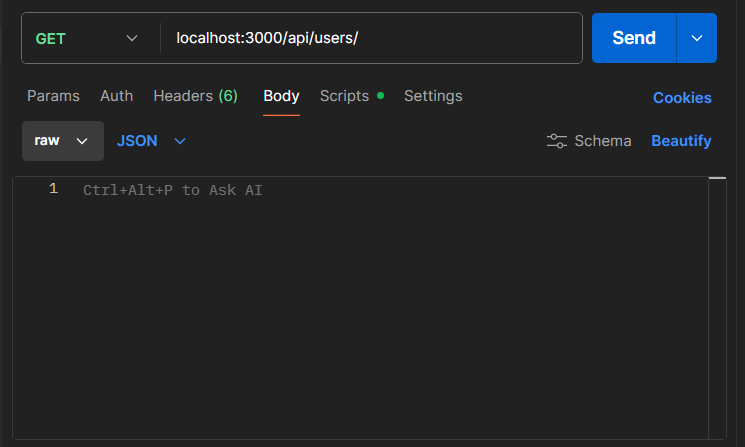

# Node REST API – Movies (Learning Project)

A simple REST-style API built with Node.js and Express.
It exposes a small in-memory list of movies and lets you:

- List all movies
- Fetch a single movie by ID
- Add a new movie
- Delete a movie

This project is purely for learning and does **not** use a real database – all data lives in memory and resets whenever you restart the server.

---

## Technologies Used

- [Node.js](https://nodejs.org/)
- [Express](https://expressjs.com/)

---

## Getting Started

### Prerequisites

- Node.js (LTS version recommended)

You can verify your version with:

```bash
node -v
npm -v
```

## Installation

### 1. Clone the Repository:

```bash
git clone https://github.com/AlistairDriscoll/node-rest-api.git
cd node-rest-api
```

### 2. Install Dependencies:

```bash
npm install
```

### 3. Run the Server:

```bash
node index.js
```

By default, the server listens on http://localhost:3000

## To Test

I used [postman](https://www.postman.com/), an API development tool to do the testing. You can put the URL along with the necessary information and send requests to the server using this technology. Really useful to see how things are working! Just go to body section and click the 'raw' option to input any information in a JSON format.



## API Overview

### Get

A GET request to http://localhost:3000/movie will return the movie list shows in at the top of the index file, is JSON format.

A GET request to http://localhost:3000/movie/1 will search for the movie with the Id of 1. If it doesn't exist it will send a 404 request with a message saying it's not been found.

### Add

A POST request with a JSON file put in the body such as:

{
  "id": 3,
  "title": "Goodfellas",
  "director": "Martin Scorsese",
  "release_date": "1990-09-19"
}

Will add the JSON to the list along with sending a 200 request.

### Delete

A Delete request sent to http://localhost:3000/movie/1 will then delete the instance with the id of 1.


## Limitations & Next Steps

This project is intentionally minimal and has a few limitations:

- No database – data is reset every time the server restarts

- No input validation or error messages on invalid request bodies

- No update (PUT/PATCH) endpoint

- Responses are a mix of JSON and plain text

Some ideas for improving the API:

- Add a PUT /movie/:id or PATCH /movie/:id endpoint

- Validate incoming data (e.g. ensure title and director are provided)

- Always return JSON responses with clear error messages

- Connect to a real database (e.g. MongoDB, PostgreSQL)